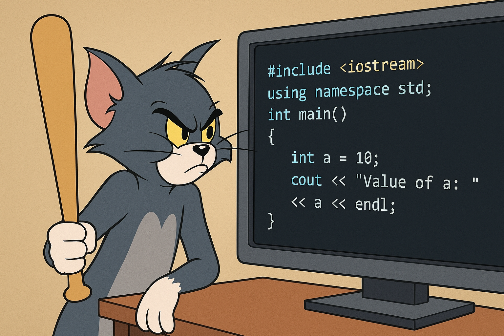

# Source Code Review Challenges (C / C++)

This repo contains a collection of the vulnerable code snippets designed for security professionals, penetration testers, and application security analysts who want to build real-world confidence in identifying and analyzing vulnerabilities.

---
# How to compile & run (Example):
```
g++ -std=c++17 -O2 challenge.cpp -o challenge
./challenge
```
